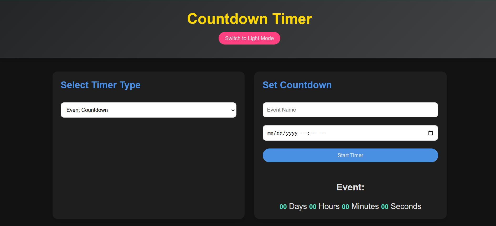

# Countdown Timer Website 🎯⏱️

Welcome to the **Countdown Timer Website**! This is a modern and visually appealing timer application that allows users to manage different types of timers and tasks with ease. The website is responsive, supports light and dark modes, and comes with exciting features to enhance productivity.

## ✨ Features

### 1. ⏳ Multiple Timer Types
- **Event Countdown**: Count down to a specific date and time.
- **Pomodoro Timer**: Work and break intervals for focused productivity.

### 2. 🔗 Shareable Countdown Links
- Generate a unique URL with the event details (e.g., `/countdown-timer?event=Meeting&date=2025-01-01T12:00:00`).
- Share the link with others so they can view the same countdown.

### 3. 🎨 Custom Themes
- Toggle between **Light Mode** and **Dark Mode**.
- Smooth transitions between themes for a better user experience.

### 4. 🔔 Notifications
- Get sound alerts when the timer ends.

### 5. 📊 Visual Progress Indicators
- Includes progress bars and visual indicators to track time remaining.

### 6. 📝 Task Management
- Add a to-do list alongside the timer to manage tasks efficiently.

### 7. 📱 Mobile Friendly
- Responsive design ensures seamless usage on all devices.

## 🛠️ Technologies Used
- **HTML**: Structure of the website.
- **CSS**: Styling and animations.
- **JavaScript**: Timer functionality, theme toggling, and task management.

## 🌐 Preview
Experience the website live here: [Countdown Timer Website](https://mohiuddin-khan-shiam.github.io/countdown-timer-website/)

## 📂 File Structure
```
countdown-timer-website/
├── index.html        # Main HTML file
├── styles.css        # CSS for styling
├── script.js         # JavaScript for functionality
├── README.md         # Project documentation
├── assets/           # Folder for images and other assets
│   ├── light-mode.png
│   ├── dark-mode.png
│   └── timer-icon.png
```

## 🚀 Installation
If you want to run the project locally, follow these steps:

1. Clone the repository:
   ```bash
   git clone https://github.com/mohiuddin-khan-shiam/countdown-timer-website.git
   ```

2. Navigate to the project directory:
   ```bash
   cd countdown-timer-website
   ```

3. Open the `index.html` file in your browser.

## 📝 Usage
1. **Select Timer Type**: Choose between Event Countdown or Pomodoro Timer.
2. **Set Timer**: Enter the event name, date, and time for the countdown.
3. **Generate Shareable Link**: Share the event countdown link with friends.
4. **Manage Tasks**: Add tasks to the to-do list and mark them as completed.
5. **Switch Themes**: Toggle between Light and Dark modes for your preferred appearance.

## 📸 Screenshots
### Light Mode


### Dark Mode


## 🤝 Contribute
Have suggestions or improvements? Feel free to open an issue or submit a pull request!

## 📜 License
This project is licensed under the MIT License.

---

Made with ❤️ by Shiam.
